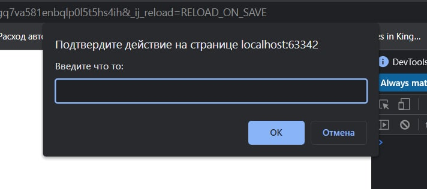

# Шпаргалка по основам JavaScript
## Основы
### Подключение скрипта в HTML
Для того чтобы подключить _JS_ сценарий нужно прописать либо в заголовке документа (header), либо в теле (body) тег `<script>`:
```html

<script type="text/javascript"></script>
</body>
```
__Примечание:__ хорошим тоном считается размещать этот тег перед закрывающим тегом `<body>`.  
> Как оказалось после 2020 писать `type="text/javascript"` уже не обязательно.

Чтобы указать источник программы в стороннем файле нужно задать в свойстве тега `src="[путь до скрипта]"`
>Функция `alert()` позволяет вызвать подтвержение действия на странице блокируя загрузку самой страницы. В качестве аргументов как вариант можно передать сообщение:
 ```javascript
alert('Hello')
```
<hr>

### Пременные
В кслассическом виде объявление переменной происходит с базового обохначения `var`, но данная конструкция устарела поэтому используется упрощенная версия и так же объявляются с помощью слов `const` или `let`.
> Как вариант отображения переменных можно воспользоваться фунцией `console.log()`, данный метод отображает переданные в него аргументы в консоли браузера.  

Константы (`const`) позволяют не изменять значения переменных, данные значения доступны только для чтения и этот способ всегда предпочтительнее для использования. `let` в данном контексте делает то  же что и `var`. 
В _JS_ как и в др языках поддерживаются и другие типы, это динамически типизируемый язык.  
Так же перменные могут начинаться с ниженего пдчеркивания или быть нижним подчеркиванием `_` или со знака доллар `$` данные символы __ПОКА__ не зарезервированы в языке
### Работа с типпами данных при учете динамической типизации - Мутирование
Вывод в консоль сообщения + переменной:
```javascript
console.log('Your name: ' + name)
```
Для того чтобы привести тип `number` к `string` используется метод `toString`:
```javascript
newAge = toString(age)
```
> Так же важно понимание того, что некоторые функции __не присутствуют__ в самом JS, а интерпритированны в браузере.  
> Например к таким функциям относятся в основном те которые призваны к взаимодействию с браузером или пользователем, например: `alert()`, `console.log()`, `console.info()` и так далее.  

<hr>

Из общего понимания еще одна браузерная функция `prompt` нужна для того чтобы взаимодействовать с пользователем для _Ввода_ перед загрузкой страницы:  

```javascript
prompt('Введите что то: ')
```
И как пример можно получать какую то информацию от пользователя и присваивать ее в переменные (в консоль почему то данная шняга не выводится):
```javascript
const someMessage = prompt('Введите что то: ')
alert(someMessage)
```
### Операторы
JS поддерживает все стандартные опрераторы сложения, вычитания, умножения, деления и тд. Но Так же он имеет и свои особенности.
Например, есть такая конструкция `value++` которая при следующему обращению к данной переменной увеличит значение на 1
```javascript
console.log(value++)  // --> 1
console.log(value)    // --> 2
```
Оператор `++` он икрементирует значение на единицу. Но если же указать этот инкремент перед переменной `++value`, то значение увеличится на единицу сразу же. Таким образом операторы выполняются в изложенном порядке. По такой же аналогии работает и оператор `--`.

<hr>

Есть возможность сложения числа подобным способом, как и в др. языках прогрммирования:
```javascript
c = c + a
```
Но JS как и Python поддерживает такую конструкцию и она считается правильной:
```javascript
c += a
```
И такая конструкция характерна и для др. операторов:
```javascript
c += a
c -= a
c *= a
c /= a
```

<hr>

### Основные типы данных в JS
Для того чтобы узнать тип переменной в JS есть функция `typeof`:
```javascript
console.log(typeof value)
```
Примитивов (_типов_)  в языке 5:
```javascript
const isProgrammer = true
const name = 'Maxim'
const age = 25
let x, a, c

console.log(typeof isProgrammer) // boolean
console.log(typeof name) // string
console.log(typeof age) // number
console.log(typeof x) // undefined
console.log(typeof null) // null

```
> Как оказалось со строкой `let x, c, a` то в JS можно объявлять сразу несколько неинициализированных переменных. Но объявить неиницилизированную переменную в порядке `const x` нельзя так как она должна в таком случае что то содержать.  

Вот все 5 типов, с последним накладочка,так как `typeof` вернет тип `object`. Это один из багов в JS.  
В языке есть еще три типа, но про них позже...  

<hr>

### Приоритет операторов
