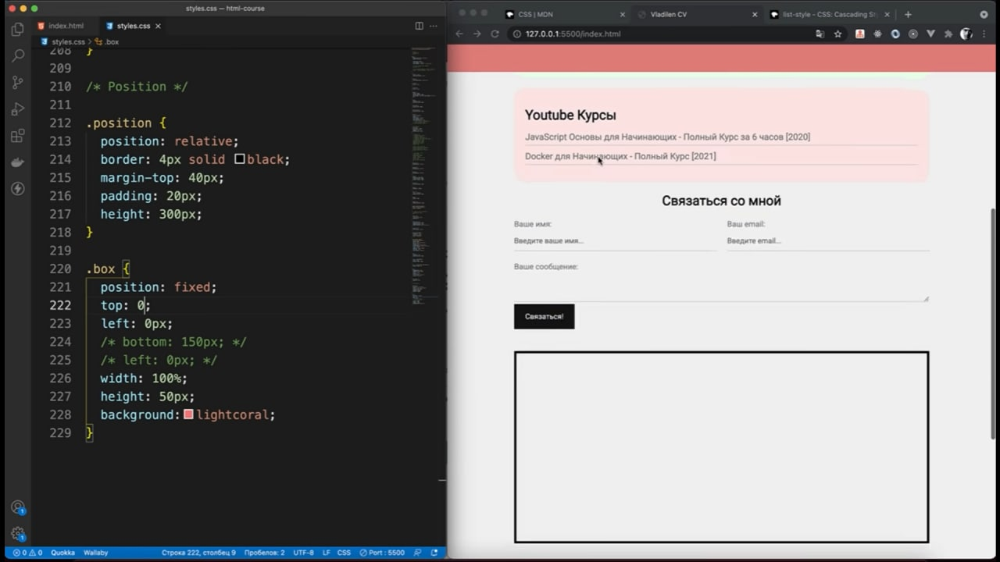

# Небольшие заметки по изучению материала
## HTML
При работе с тегами можно задавать свойства тегов в его теле 

Если нужно чтобы при переходе по ссылке открывалось __новое окно__, нужно задать свойство `target` в теле тега `<a>`:  
```HTML
<a href="lik" target="_blank">link<a/>
```  

Иногда полезно использовать такие теги как `<ol>` - список с нумерацией, и `<ul>` - список с точками.  

__Размеры__ изображений в теге `` можно задавать с помощью свойства `width` передав в него размер пикселями или прцентами  

### Создание таблиц
Чтобы созать таблицу и перечислить __строки__ `<tr>` - _table row_:
```HTML
<table>
    <tr></tr>
    <tr></tr>
    <tr></tr>
<table>
```

__Столбцы__ перечисляются в теге столбца следующей конструкцией `<td>` - _table data_:
```HTML
<table>
    <tr>
        <!-- Перечисляем столбцы -->
        <td></td>
        <td></td>
        <td></td>
    </tr>
</table>
```

__Заголовки__ к столбцам в таблице присваиваются с помощью тега `th` - _table header_:
```HTML
<table>
    <tr>
        <th>Head</th>
    </tr>
    <tr>
        <td>Data</td>
    </tr>
</table>
```

Так же в таблицах используются специализированные теги `<thead>`, `<tbody>` и `<tfoot>`.

### Работа с вомрами данных в html
Базовый тег для работы с формами это `<form>`. И для внесения в него данных используется тег `<input>` с атрибутом `type` где мы сообщаем какие данные буду вноситься в форму. А если мы хотим добавить название для _инпута_ то для этого есть тег `<label>`. Как пример связки всех этих тегов:
```HTML
<form>
    <label for="name">Your name</label>
    <input type="text" id="name">
</form>
```
Свойство тега `<input>`, `placeholder` - позволяет отоброзить текст для ввода. Так же в конце формы нужен _инпут_ со свойством `submit`, что отобразит на стрвнице кнопку отправить, с атрибутом `value` который отобразит на кнопке нашу надпись:
```HTML
<input type="text">
<br>
<input type="submit" value="Your text">
```
`<textarea>` - позволяет вводить много текста.
И еще нужно запомнить свойтво тега `form` `action` которое позволяет связывать отправляемые данные с каким либо конечным хостом или технологией для обработки.

## CSS
В свойствах шрифтов таких как `font-weight` указывается ширина шрифтов, д=либо диапазоном 100-900, либо двумя состояниями:`normal` или `bold`.  

Шрифты могут подключаться с помощью свойства `font-family`. Для подключения __кастомных шрифтов__ нужно липо скачать его или раздобыть ссылку из стороннего сервиса и воспользоваться следующей конструкцией:

```CSS
@import url("your url or link");

body {
    font-family: your fonts;
}
```

Говоря о __селекторах__ то обращение по `id` элемента, происходит следущим образом: `#id {свойства}`

### margin - border - padding
  

При обращении при слоям элемента размер в пикселях задается в след порядке:
```CSS
.container{
    /* margin or border or padding */
    margin: [top] [right] [bottom] [left];
}
```
### Вложенные элементы в CSS
Представим следущую структуру:
```HTML
<div class="box-model">
    <div></div>
    <div></div>
    <div></div>
    <div></div>
</div>
```
Говоря о селекторах если мы обращаемся к дочерним элементам на одном уровне то используем след конструкцию: `.box-model > div{}`

Для того чтобы разместить все дивы в вряд используем след код:  
```CSS
.box-model > div {
    /* Пречисляем свойства которые помогут в визуализации */
    background-color: yellow;
    height: 200px;
    width: 25%;
    border: 5px solid aqua;

    /* Позиционируем их в одну линию */
    float: left;
    box-sizing: border-box; /*указываем эту херню для учитывания бордера при размещении элементов в одну линию*/
}
```

#### Состояния селекторов
На примере ссылок отобразим, что при наведении курсора у нас будет отображаться нижнее подчеркивание. Для этого используем след код:
```CSS
a:hover {
    text-decoration: line-through;
}
```
#### Задать несколько классов в теге
Для того чтобы задать два или несколько __классов__ в теге нужно их перечислить через пробел. Так например:
```HTML
<div class="card bg-red"></div>
```
В последующем иожно обращаться к этому элементу в свойстах  _CSS_ след способом
```CSS
.card {
    padding-bottom: 20px;
}

.bg-red {
    background-color: red;
}
```

#### Обнуление свойств по умолчанию
Для того чтобы обнулить свойства _CSS_ которые используются по умолчанию используется след конструкция селектора:
```CSS
* {
    margin: 0;
    padding: 0;
}
```

#### Присваивание свойств к элементу по порядку
Для того чтобы применить стили по порядку например ко _второму_ `<h1>` или _третьему_ `<h1>` в теле `<body>` нужно испльзовать псевдоселекторы. Например вот такой конструкции для таблицы:
```CSS
.table td:nth-child([порядковый номер элемента]) {
    color: grey;
}
```
#### Стилизация форм
Выравнивание текста по центру ( так же можно и _справа_ и _слева_ также передать туда нужные параметры):
```CSS
.contact h2 {
    text-align: center;
}
```
#### Display
Для того чтобы размещать каждый элемент на новой строче (блоком) нужно передать параметром свойству `display: blok`:
```CSS
.from-group {
    display: blok;
}
```
__DISPLAY__ есть свойство расположения элементов в строчку, в столбец, в диагональ и тд. __!!!ЭТО ВАЖЮНО!!!__
##### Position 
Помимио свойства `display` в CSS есть свойство `position`. Данное свойство позоляет размещать елементы внутри какого либо блока (справа слева по центру и так далее). Например если мы ставим свойство `absolute` то элемент будет позиционироваться относительно окна браузера:
```CSS
.box {
    position: absolute;
    padding-top: 50px;
}
```
Для того чтобы данный элемент позиционировал себя относительно родительского нужно в родительском присвоить то же свойство с параметровм `relative`:
```CSS
.position {
    position: relative;
}

.box {
    position: absolute;
}
```
#### Закрепление элемента на видео
_Найти его можно по тайм-коду соостветсвующего курса_  
ДЛя того чтобы закрепить элемент вверху страницы например как на скриншоте _(например для Header)_


```CSS
.position {
    position: relative;
}

.box {
    position: fixed; /*Фиксированное размещение элемента относиельно окна браузера*/
    top: 0;
    width: 100%;
    height: 50px;
}
```